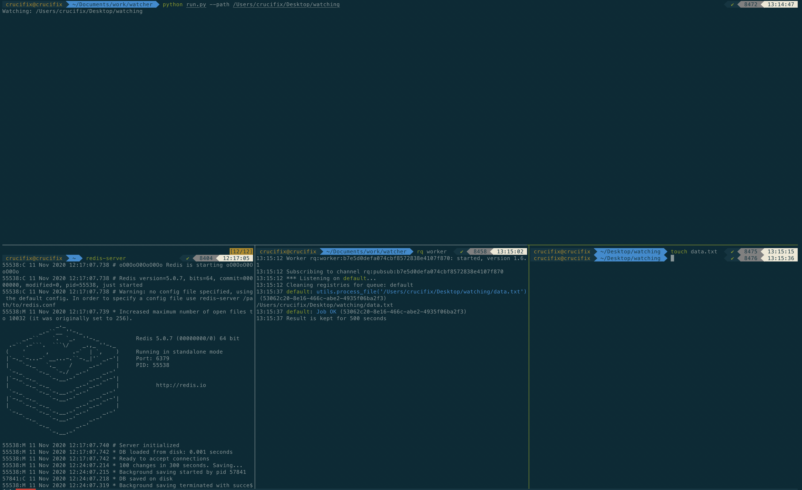

# Watcher

A simple application that demonstates how to use Watchdog, RQ and Redis to automatically process new files in a directory.

## Setup

* Environment Setup
	- $ python3 -m venv venv
	- $ source venv/bin/activate
	- $ pip install -r requirements.txt
    - Install Redis server

## How to use project
    - $ cd watcher
    - $ source venv/bin/activate
    - $ python run.py --path path/of/folder/to/watch --patterns comma seperated list of patterns  e.g  python run.py --path /Users/crucifix/Desktop/watching --patterns '.jpg, .pdf'.
      * Both the --path and --patterns are optional parameters and they default to '.' and '*' respectively. '.' for current path and '*' to watch every file.

    * Open another terminal and run the following commands.
    - $ cd watcher
    - $ source venv/bin/activate
    - $ rq worker

    * Open another terminal and navgiate to the folder you want to watch, try to create a file and watch the rq worker terminal execute the function process_file in utils.py.
    - $ e.g cd /Users/crucifix/Desktop/watching
    - $ touch data.txt

## Proof

## Who do I talk to

* Repo owner or admin (Tabot Kevin | tabot.kevin@gmail.com)

